# 🧠 Análisis Plume Network

---

<h3>📊 Plume Points (Hacer click para ver)</h3> 

 

| Fecha      | PP totales  | PP/PLUME | Puntos emitidos | Variación diaria (PP/PLUME(%)) |
|------------|-------------|----------|------------------|-------------------------------|
| 04/07/2025 | 604 029 201 | 0.2483   | –               | –                              |
| 05/07/2025 | 612 914 321 | 0.2447   | 8 885 120        | –1.4497 %                      |
| 06/07/2025 | 620 350 895 | 0.2417   | 7 436 574        | –1.1988 %                     |
| 07/07/2025 | 636 843 843 | 0.2356   | 16 492 948       | –2.5898 %                     |
| 08/07/2025 | 646 452 841 | 0.2321   | 9 608 998        | –1.4864 %                     |
| 09/07/2025 | 654 351 972 | 0.2293   | 7 899 131        | –1.2072 %                     |
| 10/07/2025 | 662 344 005 | 0.2265   | 7 992 033        | –1.2066 %                     |
| 11/07/2025 | 674 805 391 | 0.2223   | 12 461 386       | –1.8467 %                     |
| 12/07/2025 | 682 874 246 | 0.2197   | 8 068 855        | –1.1816 %                     |
| 13/07/2025 | 690 595 681 | 0.2172   | 7 721 435       | –1.1180 %                    |
| 14/07/2025 | 708 115 282 | 0.2118   | 17 519 601      | –2.4741%                    |
| 15/07/2025 | 717 585 947 | 0.2090   | 9 470 665       | -1.3197%                    |
| 16/07/2025 | 725 209 916 | 0.2068   | 7 623 969       | -1.0512%                    |
| 17/07/2025 | 732 828 472 | 0.2046   | 7 618 556       | -1.0396%                    |
| 18/07/2025 | 741 160 178 | 0.2023   | 8 331 706       | -1.1241%                    |
| 19/07/2025 | 751 610 308 | 0.1999   | 10 450 130      | -1.3903%                    |
| 20/07/2025 | 763 105 452 | 0.1965   | 11 495 144      | -1.5063%                    |
| 21/07/2025 | 784 018 577 | 0.1913   | 20 913 125      | -2.6674%                    |
| 22/07/2025 | 814 537 914 | 0.1841   | 30 519 337      | -3.7468%                    |
| 23/07/2025 | 850 059 388 | 0.1764   | 35 521 474      | -4.1787%                    |
| 24/07/2025 | 883 418 369 | 0.1697   | 33 358 981      | -3.7761%                    |
| 25/07/2025 | 918 801 637 | 0.1632   | 35 383 268      | -3.8510%                    |
| 26/07/2025 | 944 463 056 | 0.1588   | 25 661 419      | -2.7170%                    |
| 27/07/2025 | 970 165 423 | 0.1546   | 25 702 367      | -2.6492%                    |
| 28/07/2025 | 1 012 137 592 | 0.1482   | 41 972 169      | -4.1468%                    |
| 29/07/2025 | 1 042 582 274 | 0.1438   | 30 444 682      | -2.9201%                    |
| 30/07/2025 | 1 109 882 786 | 0.1351   | 67 300 512      | -6.0637%                    |
| 31/07/2025 | 1 159 690 908 | 0.1293   | 49 808 122      | -4.2949%                    |
| 01/08/2025 | 1 174 367 961 | 0.1277   | 14 677 053      | -1.2497%                    |
| 02/08/2025 | 1 187 350 874 | 0.1263   | 12 982 913      | -1.0934%                    |
| 03/08/2025 | 1 200 366 785 | 0.1249   | 13 015 911      | -1.0843%                    |
| 04/08/2025 | 1 225 607 057 | 0.1223   | 25 240 272      | -2.0594%                    |
| 05/08/2025 | 1 242 062 279 | 0.1207   | 16 455 222      | -1.3248%                    |
| 06/08/2025 | 1 259 559 285 | 0.1190   | 17 497 006      | -1.3891%                    |
| 07/08/2025 | 1 272 721 771 | 0.1178   | 13 162 486      | -1.0341%                    |
| 08/08/2025 | 1 285 392 726 | 0.1166   | 12 670 955      | -0.9857%                    |
| 09/08/2025 | 1 295 410 321 | 0.1157   | 10 017 595      | -0.7733%                    |
| 10/08/2025 | 1 303 105 287 | 0.1151   |  7 694 966      | -0.5905%                    |
| 11/08/2025 | 1 327 580 193 | 0.1129   | 23 216 679      | -1.7487%                    |
| 12/08/2025 | 1 337 176 850 | 0.1121   |  9 596 657      | -0.7176%                    |
| 13/08/2025 | 1 345 599 552 | 0.1114   |  8 422 702      | -0.6259%                    |
| 14/08/2025 | 1 358 134 261 | 0.1104   | 12 534 709      | -0.9229%                    |
| 15/08/2025 | 1 368 618 394 | 0.1095   | 10 484 133      | -0.7660%                    |
| 16/08/2025 | 1 376 968 260 | 0.1089   |  8 349 866      | -0.6063%                    |
| 17/08/2025 | 1 385 115 580 | 0.1082   |  8 147 320      | -0.5882%                    |
| 18/08/2025 | 1 424 524 755 | 0.1052   | 39 409 175      | -2.7664%                    |
| 19/08/2025 | 1 435 517 348 | 0.1044   | 10 992 593      | -0.7657%                    |
| 20/08/2025 | 1 444 431 850 | 0.1038   |  8 914 502      | -0.6171%                    |
| 21/08/2025 | 1 452 275 455 | 0.1032   |  7 843 605      | -0.5400%                    |
| 22/08/2025 | 1 460 321 872 | 0.1027   |  8 046 417      | -0.5510%                    |
| 23/08/2025 | 1 468 774 699 | 0.1021   |  8 452 827      | -0.5755%                    |
| 24/08/2025 | 1 476 527 118 | 0.1015   |  7 752 419      | -0,5250%                    |
| 25/08/2025 | 1 503 986 949 | 0.0997   | 27 459 831      | -1.8258%                    |
| 26/08/2025 | 1 513 881 023 | 0.0990   |  9 894 074      | -0.6535%                    |
| 27/08/2025 | 1 521 983 290 | 0.0985   |  8 102 267      | -0.5323%                    |
| 28/08/2025 | 1 530 132 731 | 0.0980   |  8 149 441      | -0.5325%                    |
| 29/08/2025 | 1 538 126 682 | 0.0975   |  7 993 951      | -0.5197%                    |
| 30/08/2025 | 1 546 013 488 | 0.0970   |  7 886 806      | -0.5101%                    |
| 31/08/2025 | 1 553 885 261 | 0.0965   |  7 871 773      | -0.5065%                    |
| 01/09/2025 | 1 577 372 057 | 0.0950   | 23 486 796      | -1.4889%                    |
| 02/09/2025 | 1 586 806 673 | 0.0945   |  9 434 616      | -0.5945%                    |
| 03/09/2025 | 1 595 700 132 | 0.0940   |  8 893 459      | -0.5573%                    |
| 04/09/2025 | 1 603 917 820 | 0.0935   |  8 217 688      | -0.5123%                    |
| 05/09/2025 | 1 612 466 196 | 0.0930   |  8 548 376      | -0.5301%                    |
| 06/09/2025 | 1 622 427 945 | 0.0924   |  9 961 749      | -0.6140%                    |
| 07/09/2025 | 1 632 504 430 | 0.0918   | 10 076 485      | -0.6172%                    |
| 08/09/2025 | 1 660 625 647 | 0.0903   | 28 121 217      | -1.6934%                    |
| 09/09/2025 | 1 675 597 914 | 0.0895   | 14 972 267      | -0.8935%                    |
| 10/09/2025 | 1 697 042 463 | 0.0883   | 21 444 549      | -1.2636%                    |
| 11/09/2025 | 1 722 387 777 | 0.0870   | 25 345 314      | -1.4715%                    |
| 12/09/2025 | 1 748 540 509 | 0.0857   | 26 152 732      | -1.4956%                    |

> ⚠️ **Disclaimer:**  
> Este análisis es solo un proyecto personal y un hobby. No constituye asesoría financiera ni recomendación de inversión.  
> Siempre realiza tu propia investigación (DYOR) antes de tomar cualquier decisión relacionada con criptomonedas o DeFi.  
> ¡Sé responsable y atiende tu propio perfil de riesgo!  

---

## 🗺️ Índice

- [🧠 Análisis Plume Network](#-análisis-plume-network)
  - [🗺️ Índice](#️-índice)
  - [🚀 1. ¿Qué es Plume Network?](#-1-qué-es-plume-network)
    - [🏢 Reconocimiento institucional](#-reconocimiento-institucional)
  - [📊 2. Objetivos del notebook](#-2-objetivos-del-notebook)
  - [📅 3. Contexto S2 del Airdrop](#-3-contexto-s2-del-airdrop)
  - [🔗 4. APIs utilizadas](#-4-apis-utilizadas)
  - [📌 5. Estadísticas de la Mainnet de Plume](#-5-estadísticas-de-la-mainnet-de-plume)
  - [⚙️ 6. Métricas clave para la S2](#️-6-métricas-clave-para-la-s2)
  - [📈 7. PP emitidos por día](#-7-pp-emitidos-por-día)
  - [🔍 8. Análisis de wallets (10 Julio 2025)](#-8-análisis-de-wallets-10julio2025)
  - [🔗 9. Contratos clave y patrones de interacción](#-9-contratos-clave-y-patrones-de-interacción)
  - [🎯 10. Mi estrategia](#-10-mi-estrategia)
    - [🔒 Staking](#-staking)
    - [🧪 Nest + Royco](#-nest--royco)
    - [📈 Comparativa de puntos](#-comparativa-de-puntos)
    - [🔁 Actividades diarias mínimas](#-actividades-diarias-mínimas)
  - [🗂️ 11. Ubicación del código fuente](#️-11-ubicación-del-código-fuente)
  - [🧾 12. Conclusión](#-12-conclusión)
  - [🔍 13. Análisis de sybils y redes (snapshot 20 Ago 2025)](#-13-análisis-de-sybils-y-redes-snapshot-20-ago-2025)
    - [📂 Flujo de análisis](#-flujo-de-análisis)
    - [📊 Estadísticas Generales](#-estadísticas-generales)
    - [🌐 Redes](#-redes)

---

Este análisis forma parte de la serie `Diario_de_un_farmer`, donde documento mis decisiones en Web3.

## 🚀 1. ¿Qué es Plume Network?

Plume es una blockchain pública, compatible con la Máquina Virtual de Ethereum (EVM), diseñada para impulsar la próxima evolución de los Activos del Mundo Real (Real World Assets, RWA). No se limita a la simple tokenización de activos: su objetivo es permitir que puedan usarse de forma nativa como criptomonedas — permitiendo staking, intercambios, préstamos, préstamos apalancados (looping) y más.

A través de la integración de activos institucionales con herramientas DeFi, Plume permite que activos tradicionalmente inaccesibles — como crédito privado, ETFs y materias primas — se vuelvan componibles, sin permisos y utilizables con unos pocos clics.

Su misión es sencilla: tender un puente entre las finanzas tradicionales y el ecosistema cripto mediante una adopción impulsada por la demanda, sin sacrificar la transparencia, la apertura ni la experiencia del usuario.

### 🏢 Reconocimiento institucional

Otro punto destacado es que **Grayscale** incluyó a Plume en su listado de activos a evaluar. Esto aporta un respaldo adicional, al estar en el radar de uno de los mayores gestores de activos digitales.

  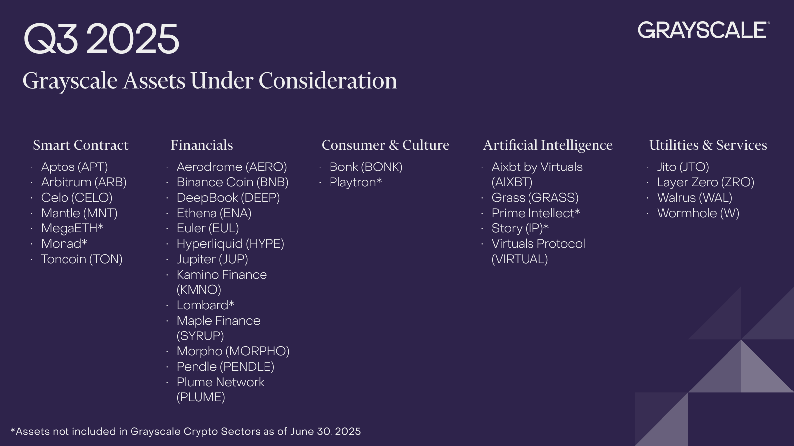
   
  <em>Fuente: <a href="https://x.com/Grayscale/status/1943365202680123888">tweet de Grayscale</a></em>

> **Por qué importa:**  
> Estar en la lista de Grayscale significa que Plume entra en una due diligence institucional, lo que mejora su visibilidad y confianza en el mercado.  

---

## 📊 2. Objetivos del notebook

1. **Inventariar y documentar** las APIs de Plume  
2. **Explorar** los datos de mi wallet y PP (Plume Points)  
3. **Identificar** las acciones más rentables para farmear PP  
4. **Diseñar** estrategias eficientes para la Season 2 del airdrop  
5. **Extraer insights** prácticos para recursos limitados  

---

## 📅 3. Contexto S2 del Airdrop

- **Asignación total:** 150 000 000 PLUME  
- **Periodo:** 5 de junio 2025 – TBA (por anunciar)  
- **Criterio principal de distribución:** Plume Points (PP)

**¿Qué son los PP?**  
Son puntos otorgados por interactuar con diferentes dApps (Bridge, DEX, Lending, etc.) o participar en campañas. Existen dos categorías:

1. **Self PP:** generados por la propia actividad en la red.  
2. **Referral PP:** obtenidos en función a la actividad de los usuarios invitados.

> ⚠️ La asignación de PP no es lineal ni perfectamente predecible: la misma acción un día puede otorgar distinta cantidad de puntos en otra ocasión.

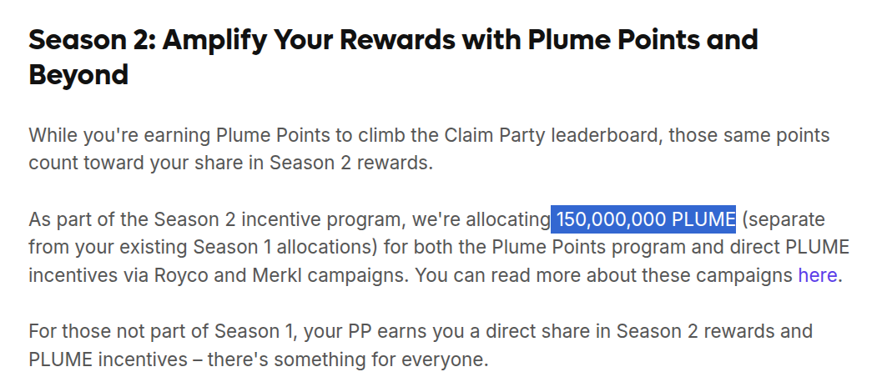  
*Fuente: [Plume Blog](https://plume.org/blog/plume-airdrop)*

---

## 🔗 4. APIs utilizadas

| Uso                                                  | Notas                                                                                                 | Enlace                                                                                           |
|------------------------------------------------------|--------------------------------------------------------------------------------------------------------|--------------------------------------------------------------------------------------------------|
| Mostrar el leaderboard general                       | Se pueden modificar los parámetros `offset` (posición inicial) y `count` (cantidad de resultados).    | https://portal-api.plume.org/api/v1/stats/leaderboard?offset=3600&count=10&walletAddress=undefined&overrideDay1Override=false&preview=false |
| Ver las 3 actividades que más generaron PP ayer      | Usa el parámetro `walletAddress=` con cualquier wallet para obtener resultados personalizados.        | https://portal-api.plume.org/api/v1/stats/pp-totals/?walletAddress=0xff0c6444cb0fa6121a85e838219354bfe2e1556b |

---

## 📌 5. Estadísticas de la Mainnet de Plume

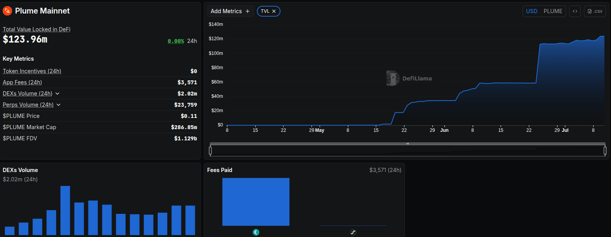

Con un **TVL** (Total Value Locked) de 120 M USD, Plume confirma su solidez como L2.

*Fuente: [Defillama](https://defillama.com/chain/plume-mainnet)*

---

## ⚙️ 6. Métricas clave para la S2

Antes de definir estrategias, identifiqué **qué actividades generan más PP**:

1. Consulté la API del leaderboard para listar todas las wallets con > 0 XP.  
2. Para cada wallet, extraje sus **tres actividades top** en PP.  
3. Conté la frecuencia de cada acción en el **top 3 global**.

> **Conclusión preliminar:**  
> Las interacciones con protocolos y el staking dominan el top 3. Sin embargo, dado mi capital limitado, no puedo destinar una gran cantidad al staking. Solo una parte, ya que no me parece una opción suficientemente rentable, así que me concentraré en interacciones.

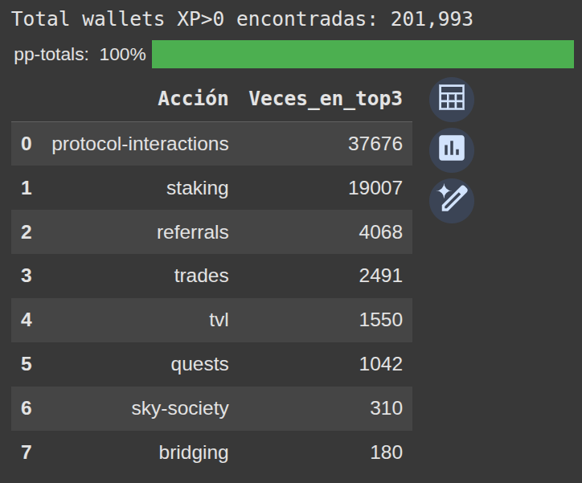

| Wallet        | Rank en leaderboard | $PLUME en stake |
|---------------|---------------------|------------------|
| 0xff0...      | 1                   | 1,880,000        |
| 0x4ce...      | 2                   | 1,080,000        |
| 0x861...      | 3                   | 800,000          |
| 0xE3c... (yo) | 1288                | 2110             |

> **Insight:**  
> Estar en el puesto 1 288 de más de 200k+ wallets confirma que mi estrategia con recursos limitados ha funcionado. Mi enfoque será en **interacciones DeFi de bajo costo**, complementadas con **staking** y **bloqueos selectivos** en protocolos clave, sin comprometer la totalidad de mi capital.

---

## 📈 7. PP emitidos por día

| Fecha      | PP totales  | PP/PLUME | Puntos emitidos | Variación diaria (PP/PLUME(%)) |
|------------|-------------|----------|------------------|-------------------------------|
| 04/07/2025 | 604 029 201 | 0.2483   | –               | –                            |
| 05/07/2025 | 612 914 321 | 0.2447   | 8 885 120        | –1.4497 %                     |
| 06/07/2025 | 620 350 895 | 0.2417   | 7 436 574        | –1.1988 %                     |
| 07/07/2025 | 636 843 843 | 0.2356   | 16 492 948       | –2.5898 %                     |
| 08/07/2025 | 646 452 841 | 0.2321   | 9 608 998        | –1.4864 %                     |
| 09/07/2025 | 654 351 972 | 0.2293   | 7 899 131        | –1.2072 %                     |
| 10/07/2025 | 662 344 005 | 0.2265   | 7 992 033        | –1.2066 %                     |
| 11/07/2025 | 674 805 391 | 0.2223   | 12 461 386       | –1.8467 %                     |
| 12/07/2025 | 682 874 246 | 0.2197   | 8 068 855        | –1.1816 %                     |

> 🧮 **Nota técnica:**  
> La **variación diaria (%)** del ratio **PP/PLUME** permite entender qué tan rápido se está diluyendo el valor de los puntos (PP) en relación a la cantidad total de tokens PLUME asignados para la Season 2.  
> El ratio **PP/PLUME** se calcula de manera directa: basta con dividir la asignación total de 150 M de PLUME entre el total de PP emitidos en cada fecha.

---

## 🔍 8. Análisis de wallets (10 Julio 2025)

- **Wallets únicas analizadas:** 201 993  

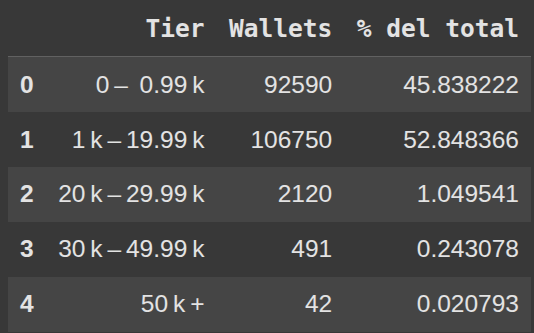

Se observa un gran número de wallets con menos de 1 000 PP, lo que sugiere la posible presencia de sybils.

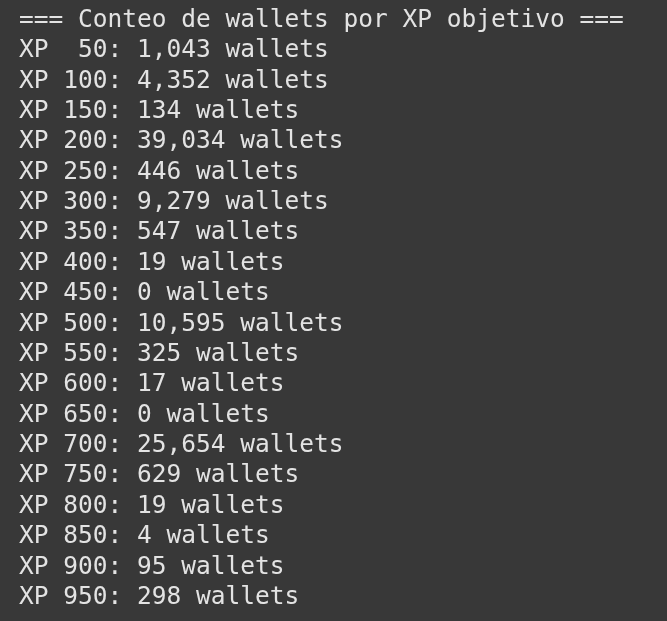

> De las ~201 K wallets, **39 K** tienen exactamente 200 PP a 30 días del inicio de la S2. Es muy probable que se trate de sybils.

---

## 🔗 9. Contratos clave y patrones de interacción

| Uso              | Contrato                                    | Interacciones | Wallets que lo usan |
|------------------|---------------------------------------------|--------------:|--------------------:|
| Stake            | `0x30c7…fede871`                            |        1 183  |                  71 |
| Daily Spin       | `0xb8e9…73d71`                              |        2 108  |                  67 |
| Nest Alpha Vault | `0x593c…38db`                               |          645  |                  63 |
| Re7 pUSD         | `0xc0df…5b16`                               |          864  |                  60 |
| PUSD Token       | `0xdddd…6f3f`                               |        4 263  |                  66 |

---

## 🎯 10. Mi estrategia

### 🔒 Staking
Delegué en el validador oficial, **Plume Foundation**.

  <a href="https://staking.plume.org/">
    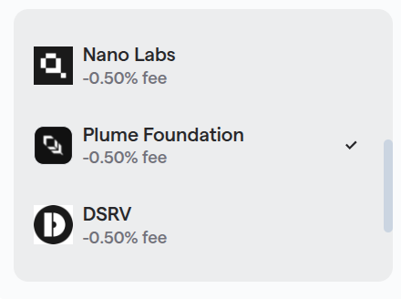
  </a>

### 🧪 Nest + Royco

1. Deposité **pUSD en el nALPHA Vault**  
2. Usé los tokens generados en **Royco**

  <a href="https://app.nest.credit/">
    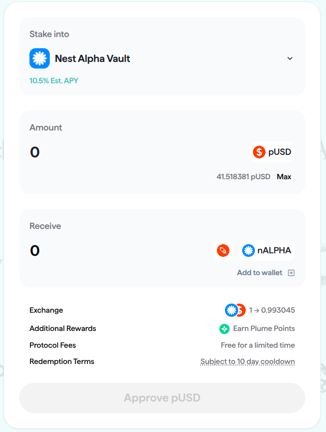
  </a>

  👉 <a href="https://app.nest.credit/">Fuente: app.nest.credit</a>

  <a href="https://plume.royco.org/market/98866/0/0xc41a78d629855b99788af7449020a88eec807be5f26ab050908dd7e633735897">
    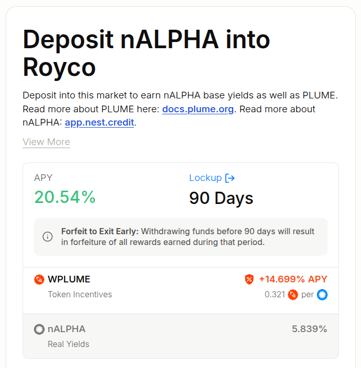
  </a>

  👉 <a href="https://plume.royco.org/market/98866/0/0xc41a78d629855b99788af7449020a88eec807be5f26ab050908dd7e633735897">Royco nALPHA pool</a>

También diversifiqué ligeramente en:

  <a href="https://plume.royco.org/market/98866/0/0x40bb8b77686fdea111f3e5b369dacd049abb8224550b453b6308b1038638e355">
    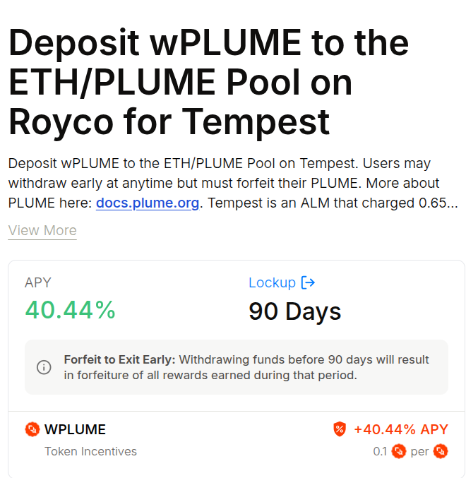
  </a>

  👉 <a href="https://plume.royco.org/market/98866/0/0x40bb8b77686fdea111f3e5b369dacd049abb8224550b453b6308b1038638e355">Royco WPLUME pool</a>

---

### 📈 Comparativa de puntos

Antes de los depósitos :

  

Después de los depósitos:

  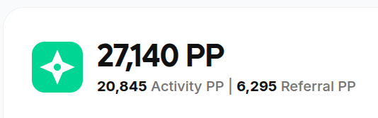

---

### 🔁 Actividades diarias mínimas

- ✅ Stakear 1 $PLUME  
- 🎰 Realizar el **Daily Spin**  
- 🔄 Hacer un **swap**  
- 💧 Depositar nALPHA en **Royco**

---

## 🗂️ 11. Ubicación del código fuente

🔗 [Abrir `Notebook.ipynb`](./Notebook.ipynb)

---

## 🧾 12. Conclusión

Este análisis no intenta prometer ganancias rápidas ni vender humo. Es solo una guía basada en mi experiencia real como usuario con recursos limitados. La idea es compartir lo que he aprendido sobre cómo moverse de forma inteligente en Plume y sacarle provecho al ecosistema con decisiones simples, pero pensadas.

  👉 <a href="https://portal.plume.org/?referrer=XanthicReliablePot183">Ir al portal de Plume S2</a>

---

## 🔍 13. Análisis de sybils y redes (snapshot 20 Ago 2025)

Han pasado algunas semanas desde que puse el primer commit en este diario, asi que vamos con las actualizaciones. Este apartado corresponde al trabajo de detección de **sybils** en Plume Network.  
Los datos provienen del archivo [`data/plume_networks.json`](./data/plume_networks.json), generado con los notebooks de la **fase 1 a fase 4** en `Parte2_sybils.ipynb`.

### 📂 Flujo de análisis

1. **Fase 1** → Extracción de wallets (`plume_wallets.json`).  
2. **Fase 2** → Enriquecimiento con XP, transacciones y actividad (`plume_wallets_enriched.json`).  
3. **Fase 3** → Construcción de las redes de referidos y generación del árbol (`plume_networks.json`).  
4. **Fase 4** → Análisis agregado: estadísticas globales, sybils por red, % de XP comprometido, etc.

### 📊 Estadísticas Generales

- **Total de wallets:** 247,761  
  - 🕵️ **Wallets Sybil:** 166,093 (67.04%)  
  - ✅ **Wallets Legítimas:** 81,668 (32.96%)  

- **XP total acumulado:** 1,444,431,850  
  - 🕵️ **XP Sybil:** 267,286,468 (18.50%)  
  - ✅ **XP Legítimo:** 1,177,145,382 (81.50%)  

### 🌐 Redes

- **Total de redes:** 105,399  
- **Redes con >80% sybil:** 72,541  

🏆 **Top 3 redes más grandes (por número de wallets):**  
1. Root: `0x87cb894a65be758f1624ccd9c6dc0716e97c5fec`  
   - Wallets: 33,938  
   - XP: 7,040,950  
   - % Sybil: 100.00%  

2. Root: `0x53ab2038ad0a68b986cc43e5c4fa66457886dcd4`  
   - Wallets: 9,816  
   - XP: 8,737,271  
   - % Sybil: 98.31%  

3. Root: `0x537e466b329f5f439059e69ad8d144637fd461d4`  
   - Wallets: 5,027  
   - XP: 26,209,243  
   - % Sybil: 75.15%  

📌 **Insights adicionales:**  
- Promedio de wallets por red: 2.35  
- Red más grande contiene 33,938 wallets  
- Red más pequeña contiene 1 wallet  

---

> 📅 **Nota:** Este análisis corresponde a un snapshot tomado el **20 de agosto de 2025**.  
> En el futuro, los resultados podrían variar conforme se detecten más wallets y se actualice la base de datos.
